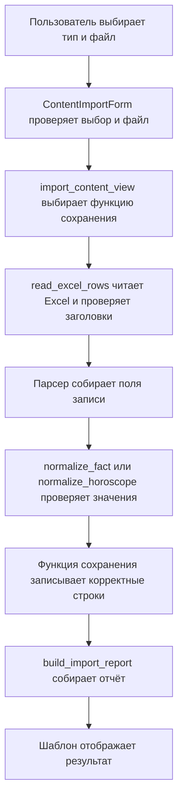

# Как устроен импорт после рефакторинга

Дата: 07.10.2026. Учебный проект: `factoskope2`.

В этой заметке объясняются изменения: общее чтение Excel, общая форма,
единая страница импорта, единый отчёт и получение гороскопов одним запросом.

## 1. Что пользователь делает на странице

Откройте `/admin/` и нажмите «Загрузить Excel». Откроется
`/admin/content/import/`. Выберите «Факты» или «Гороскопы», выберите
соответствующий отдельный файл `.xlsx` и нажмите «Импортировать».

Файл фактов можно загрузить один раз, а гороскопы — загружать ежемесячно.
Общая страница не требует объединять их в один файл.

| Выбор | Обязательные колонки | Дополнительные колонки |
| --- | --- | --- |
| Факты | Текст | Категория |
| Гороскопы | Дата, Знак, Текст | Нет |

Корректные строки сохраняются сразу. Строки с ошибками пропускаются,
их номера и причины ошибок отображаются на странице. Гороскопы
сохраняются черновиками: после проверки в админке нужно снять отметку
«Черновик», чтобы они появились в публичном API.

Важно: раньше страница гороскопов только проверяла файл. Теперь общая
страница также сохраняет корректные гороскопы. Предварительного просмотра
перед сохранением в этом сценарии нет.

## 2. Путь данных от файла до базы



Каждый участок решает небольшую задачу. Благодаря этому при изменении
чтения Excel не требуется менять HTML, а при изменении текста отчёта
не требуется менять правила сохранения фактов.

## 3. Общее чтение Excel: services.py

### Зачем выделена read_excel_rows

Раньше `parse_facts` и `parse_horoscop` повторяли открытие книги, чтение
заголовков, пропуск пустых строк и закрытие файла. Эти действия теперь
находятся в `read_excel_rows`.

Парсер фактов вызывает её так:

```python
excel_rows = read_excel_rows(file_path, required_columns={"Текст"})
```

Парсер гороскопов передаёт свои обязательные колонки:

```python
excel_rows = read_excel_rows(
    file_path,
    required_columns={"Дата", "Знак", "Текст"},
)
```

`file_path` — путь к Excel или объект загруженного файла. Название и
аннотация `str` пока сохранены из существующего кода, хотя в админке
передаётся объект файла. `required_columns` — набор необходимых заголовков.

### Что возвращает чтение

Допустим, во второй строке Excel находится факт. Получится:

```python
[
    (2, {"Текст": "У осьминога три сердца.", "Категория": "Животные"}),
]
```

Это список пар. В каждой паре первый элемент — номер строки Excel,
второй — словарь её значений. Номер нужен для сообщения «Ошибка в строке 2».

Код `dict(zip(headers, row))` соединяет названия колонок с ячейками:

```text
Текст     → У осьминога три сердца.
Категория → Животные
```

Строки полностью читаются в список до `workbook.close()`. `finally`
закрывает книгу и при успешном чтении, и при ошибке заголовков. Готовый
список можно обрабатывать после закрытия книги. Он занимает дополнительную
память для исходных строк.

### Зачем остались два парсера

Факты и гороскопы имеют разные поля и правила проверки. `parse_facts`
собирает `text` и `category`, а `parse_horoscop` — `date`, `sign` и `text`.

Например, парсер фактов собирает:

```python
fact_data = {
    "text": excel_row_data.get("Текст"),
    "category": excel_row_data.get("Категория"),
}
```

Затем `normalize_fact` удаляет пробелы по краям, проверяет текст и длину
категории. У гороскопов отдельно проверяются дата и знак. Ошибка значения
одной строки не мешает обработать остальные. Ошибка обязательных заголовков
останавливает импорт до сохранения.

## 4. Общая форма: forms.py

`ExcelImportForm` содержит обязательное поле `file` и общий метод
`clean_file`, который проверяет расширение `.xlsx` и размер до 5 МБ.

`ContentImportForm` наследует эти проверки и добавляет выбор типа:

```python
class ContentImportForm(ExcelImportForm):
    content_type = forms.ChoiceField(
        label="Тип данных",
        choices=[("facts", "Факты"), ("horoscopes", "Гороскопы")],
    )
    field_order = ["content_type", "file"]
```

Наследование означает, что форма получает поле и метод родительского
класса. Проверку файла не нужно писать второй раз. Старые отдельные формы
фактов и гороскопов заменены `ContentImportForm`.

В каждой паре `choices` первое значение отправляется на сервер,
второе показывается человеку. Например, пользователь видит «Факты»,
а сервер получает строку `"facts"`.

`field_order` указывает порядок полей: сначала выбор типа, затем файл.

При `form.is_valid()` Django проверяет обязательные поля, допустимый
выбор и вызывает `clean_file`. Только после успешной проверки данные
берутся из `form.cleaned_data`. Проверка формы не разбирает содержимое
Excel: это следующая задача сервисов.

## 5. Общий обработчик страницы: views.py

Два обработчика заменены одной функцией `import_content_view`.

### GET: открыть страницу

GET — обычный запрос браузера при открытии адреса. Для него создаётся
пустая форма `ContentImportForm()`. Шаблон рисует поля на странице.

### POST: отправить файл

Нажатие «Импортировать» отправляет POST. Обработчик создаёт связанную форму:

```python
form = ContentImportForm(request.POST, request.FILES)
```

В `request.POST` находятся значения обычных полей, включая тип контента.
В `request.FILES` находится загруженный файл. Это два разных источника
данных одного запроса.

После `is_valid()` получаем:

```python
content_type = form.cleaned_data["content_type"]
excel_file = form.cleaned_data["file"]
```

### Выбрать функцию сохранения

```python
if content_type == "facts":
    save_content = save_facts_database
else:
    save_content = save_horoscopes_database
```

Здесь функция присваивается переменной без круглых скобок: вызова пока
нет. Переменная `save_content` ссылается на выбранную функцию.

Позже выполняется общий вызов:

```python
report = save_content(excel_file)
```

Круглые скобки означают вызов. В `report` попадает результат работы
выбранной функции — словарь отчёта.

### Проверить права

Импорт может и создавать, и обновлять записи, поэтому обработчик проверяет
два разрешения выбранной модели: `add` и `change`. Например, для фактов
это `content.add_fact` и `content.change_fact`. При отсутствии прав
возвращается запрет доступа.

### Показать ошибку файла

Если сервис сообщает `ValueError`, обработчик добавляет сообщение к полю:

```python
form.add_error("file", str(exc))
```

Пользователь видит ошибку возле выбора файла. Ошибки отдельных строк
находятся в отчёте и показываются ниже формы.

## 6. Единый отчёт: services.py

Добавлена функция `build_import_report`. Обе функции сохранения используют
её и возвращают одинаковую структуру:

```python
{
    "Создано": 2,
    "Обновлено": 1,
    "Ошибки": [
        {"Строка": 5, "Причина": "Текст факта не может быть пустым"},
    ],
}
```

Русские ключи сохранены из существующих сервисов. Изменился способ
сборки отчёта: он находится в одном месте. Шаблон получает весь словарь
под ключом `report`, вместо отдельных счётчиков для каждого типа.

«Обновлено» означает, что запись найдена и обработана. Она учитывается
в этом счётчике даже при неизменном содержимом — это прежнее правило.

Признак `success` заменён на `import_completed`. Он означает «обработка
файла завершилась», а не «все строки правильные». Например, файл может
содержать 2 правильные и 3 ошибочные строки. Страница покажет оба результата.
Если правильных строк нет, она сообщает, что записи не сохранены.

## 7. Общая страница в админке

### admin_site.py

Добавлен `ContentAdminSite`, наследник стандартного `AdminSite`.
Он добавляет адрес `content/import/` к обычным страницам админки.

```python
return custom_urls + super().get_urls()
```

`super().get_urls()` получает стандартные адреса Django admin.
`custom_urls` — наш дополнительный маршрут. Он стоит первым, чтобы
общая обработка адресов админки не перехватила его раньше.

В `config/urls.py` админка уже подключена под `admin/`, поэтому итоговый
адрес — `/admin/content/import/`. Имя маршрута — `admin:content_import`.
Шаблоны используют это имя, чтобы Django сам собрал адрес ссылки.

`self.admin_view(import_content_view)` оборачивает обработчик проверкой
входа и доступа к админке. Отдельная проверка разрешений выбранной модели
находится в самой view.

### config/settings.py

В `INSTALLED_APPS` вместо обычного `django.contrib.admin` подключён
`content.admin_site.ContentAdminConfig`. Он наследует стандартный
`AdminConfig` и указывает класс нашего административного сайта:

```python
default_site = "content.admin_site.ContentAdminSite"
```

Это стандартный механизм расширения Django admin. Регистрация моделей
через `@admin.register(...)` продолжает работать.

### admin.py

Из администраторов моделей убраны два собственных маршрута импорта.
Оба списка используют один шаблон кнопки
`admin/content/import_change_list.html`. Общая кнопка добавлена и на
главную страницу админки.

Старые отдельные адреса `/admin/content/fact/import/` и
`/admin/content/horoscope/import/` больше не являются страницами импорта.
Пользуйтесь `/admin/content/import/`.

## 8. Общий шаблон import_content.html

Шаблон — HTML с командами Django для вывода данных. Он наследует
`admin/base_site.html`, поэтому использует оформление и навигацию админки.

`{{ form.as_p }}` выводит поля формы. `enctype="multipart/form-data"`
нужен для отправки файла, а `` добавляет токен защиты
формы, который Django проверяет при POST.

Шаблон показывает отчёт после завершения обработки:

```django

    Создано: {{ report.Создано }}

```

`report.Создано` в шаблоне читает значение ключа `"Создано"` словаря.
Цикл по `report.Ошибки` выводит номера строк и причины ошибок. Значения
по умолчанию экранируются Django при выводе в HTML.

Два прежних шаблона страниц импорта заменены общим.

## 9. Получение гороскопов одним запросом

Раньше `HoroscopeAPIView` для каждого знака делал `exists()`, а при
наличии записи — `first()`. При наличии всех 12 знаков выполнялось
до 24 отдельных запросов к базе.

Теперь сначала выполняется:

```python
texts_by_sign = dict(horoscopes.values_list("sign", "text"))
```

`values_list` выбирает два поля: код знака и текст. Результат выглядит так:

```python
[
    ("aries", "Текст для Овна"),
    ("taurus", "Текст для Тельца"),
]
```

`dict` превращает пары в словарь:

```python
{
    "aries": "Текст для Овна",
    "taurus": "Текст для Тельца",
}
```

Получение этих пар выполняется одним запросом. Дальше строится ответ:

```python
data = {
    sign.label: texts_by_sign.get(sign.value)
    for sign in ZodiacSign
}
```

У знака есть `value` — код, например `"aries"`, и `label` — подпись,
например `"Овен"`. По коду берём текст, а подпись используем в ответе:

```python
{"Овен": "Текст для Овна", "Телец": "Текст для Тельца", "Близнецы": None}
```

Если записи нет, `.get()` возвращает `None`; в JSON это `null`.
Все 12 русских названий остаются в ответе. Условия отбора активных,
нечерновых записей на дату сохраняются. Внутри цикла запросов к базе нет.

## 10. Что проверено

Проверен синтаксис изменённых Python-файлов. Django инициализируется,
маршрут `admin:content_import` разрешается в `/admin/content/import/`,
модели фактов и гороскопов зарегистрированы. Проверена загрузка новых
шаблонов и отсутствие ошибок пробелов в diff.

Существующие UI-тесты обновлены под общий адрес и сохранение гороскопов,
но тесты и загрузка реальных файлов после этого изменения не запускались.
Результат сохранения через новую страницу пока не подтверждён запуском.

Модели и миграции не менялись. После изменения настройки административного
сайта при необходимости перезапустите сервер разработки.

## Документация Django

- [Поля формы и ChoiceField](https://docs.djangoproject.com/en/5.2/ref/forms/fields/#choicefield)
- [Проверка форм](https://docs.djangoproject.com/en/5.2/ref/forms/validation/)
- [Расширение AdminSite](https://docs.djangoproject.com/en/5.2/ref/contrib/admin/#adminsite-objects)
- [Выбор своего административного сайта](https://docs.djangoproject.com/en/5.2/ref/contrib/admin/#overriding-the-default-admin-site)
- [QuerySet.values_list](https://docs.djangoproject.com/en/5.2/ref/models/querysets/#values-list)
